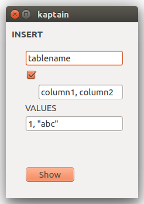
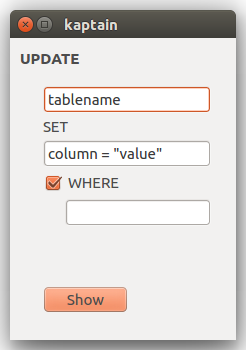
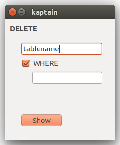
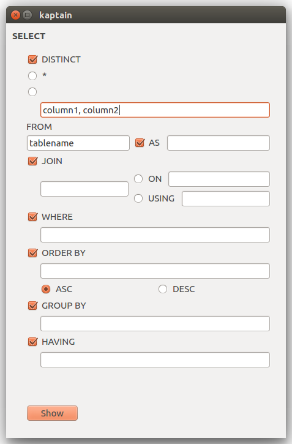

# QueryHammer

QueryHammer is an ongoing project to create a  visual tool that helps you specify data queries interactively.

## Motivation

Existing database systems usually use text-based query language for data retrieval. There are basically two ways how you can specify your query:

- text based languages
  - flexible
  - but time consuming to learn
- graphical interfaces
  - intutive, small learning curve
  - but offer limited functuonality
  - hand-crafted - when the new specification is released, these tools need to be updated manually (and that is why they usually offer limited functionality)

The goal of this tool is to combine best of both approaches and work universally for different query languages.

## Progress report

### Approach 1 - Automatic transformation of grammars

The first pass was by using a formal grammar of the query language (in EBNF or similar format) and generate user interface from it. While having the advantage to be compatible with full feature-set, this approach turned out not viable for several reasons:
- Grammars for complicated languages are usually not complete, automatic parsing fails.
- Grammars have many low-level rules which make the final UI complicated and not user friendly.

### Approach 2 - Handcrafted custom UI

Second pass took opposite direction. The idea was not to use a grammar but to build the UI more like a traditional app from components using React. This has advantages that UI can be more tailored and customized. However, it is less formal and has limited set of features because of it.

Here is a work-in-progress example of an interface for generating SPARQL queries:

### Approach 3 - Grammars again (Kaptain)

I found a cool tool called [Kaptain](http://kaptain.sourceforge.net/) which takes a grammar file and generates graphical UI using Qt4. It is very similar concept I had in mind. User can fill in the values and the tool generates the final textual query. The tool is language agnostic. There are special annotations to control layout and input data types.

I've experimented with Kaptain to create UI to help build SQL queries (INSERT, UPDATE and DELETE):

  

And slightly more complicated SELECT query:

There is also a cool example showing how to generate [single purpose UI for database access](http://kaptain.sourceforge.net/docs/database/). Although it is a very interesting approach the tool has some limitations:

- No support recursion.
- Rules cannot occur multiple times (e.g. if tabbed interface, we cannost share `where_clause` rule in select, update and others).
- Default values for choices (`|` operator) cannot be specified. Also default state for optional rules cannot be specified.
- No web interface.
- Extending with additional functionality of customizing UI would be difficult.

## Future work

For the next pass I would like to combine advantages of approach 2 and 3. To have a system that is formally expressive as grammars, but is written as React components that would allow easy customization.
